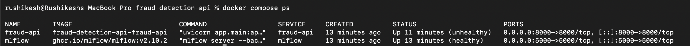
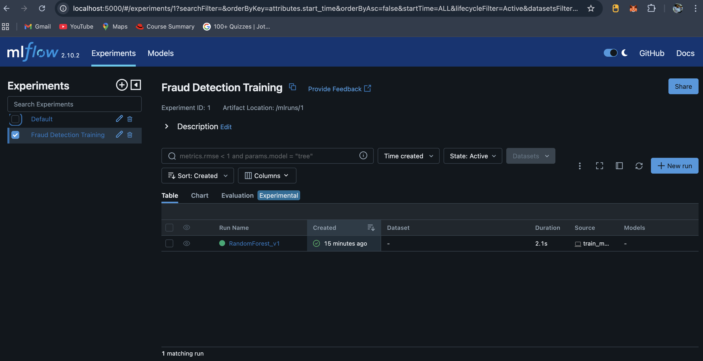
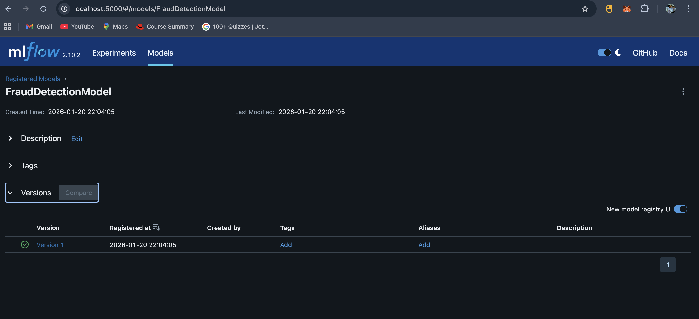
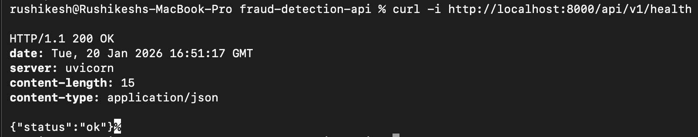
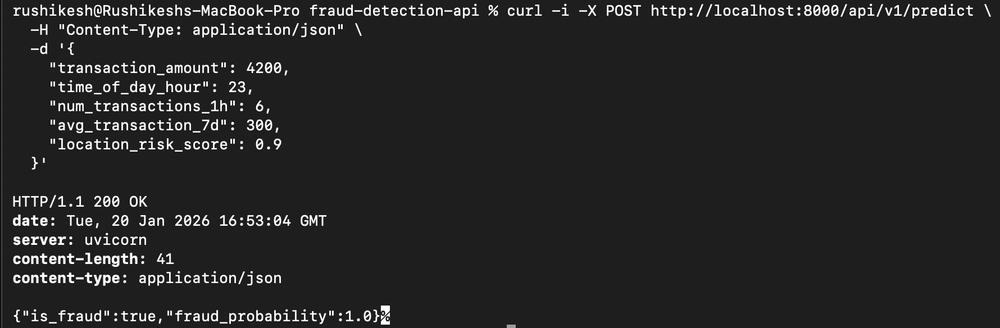
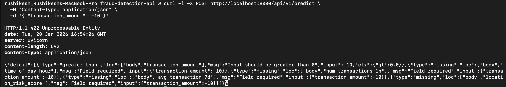
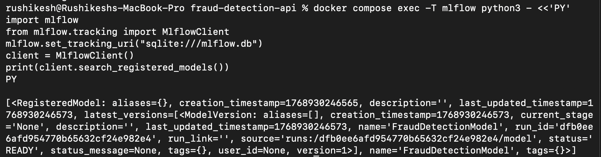

# Fraud Detection API — Production-Ready ML Inference Service

## Overview
This project implements a production-ready, containerized fraud detection inference API built with FastAPI and MLflow. It demonstrates a complete MLOps workflow: synthetic data generation, model training, experiment tracking, model registration, and scalable model serving using Docker Compose.

The system exposes REST endpoints for health checks and fraud prediction, validates inputs using Pydantic, logs structured application events, and loads a registered model directly from the MLflow Model Registry at runtime. The setup is fully reproducible on any machine with Docker installed.

---

## Key Features
- RESTful API built with FastAPI
- Strict request validation using Pydantic schemas
- Pre-trained scikit-learn fraud detection model
- MLflow experiment tracking and Model Registry integration
- Model loading via `models:/` URI from MLflow
- Structured JSON logging for application events
- Multi-stage Docker build for optimized image size
- Docker Compose orchestration with persistent MLflow backend
- Unit and integration test coverage

---

## Architecture Summary
- **API Layer**: FastAPI application exposing `/api/v1/health` and `/api/v1/predict`
- **Service Layer**: Centralized fraud detection service responsible for model loading and inference
- **ML Lifecycle**: Synthetic data → training → MLflow tracking → model registration → runtime loading
- **Infrastructure**: Dockerized services orchestrated via Docker Compose

---

## Project Structure
```
.
├── app/
│   ├── main.py
│   ├── api/v1/endpoints.py
│   ├── services/fraud_service.py
│   ├── models/schemas.py
│   └── core/
│       ├── config.py
│       └── logging_config.py
├── tests/
│   ├── unit/test_fraud_service.py
│   └── integration/test_api.py
├── Dockerfile
├── docker-compose.yml
├── requirements.txt
├── generate_data.py
├── train_model.py
├── .env.example
└── README.md
```

---

## Prerequisites

- Docker
- Docker Compose

No local Python environment setup is required when using Docker.

---

## Environment Configuration
The application uses environment variables for configuration.

An example file is provided:
```
.env.example
```

Key variables:
- `MLFLOW_TRACKING_URI` – MLflow tracking server URL
- `MODEL_NAME` – Registered model name (default: `FraudDetectionModel`)
- `MODEL_VERSION` – Model version to load (default: `1`)

---

## Running the System (End-to-End)

The recommended flow is to use Docker Compose to bring up the FastAPI service and the MLflow tracking server (with persistent backend). All commands below assume you are in the repository root.

### 1. Build and Start Services

```
docker compose up --build -d
```

This starts:
- Fraud Detection API on **http://localhost:8000**
- MLflow Tracking UI on **http://localhost:5000**

---

### 2. Wait for services to be healthy. You can inspect status with:

```
docker compose ps
```

---

### 3. Generate synthetic data (inside fraud-api container):

```
docker compose exec -T fraud-api python generate_data.py
```

Expected output:

```Synthetic data generated at data/raw_transactions.csv```

---

### 4. Train the model and register it to the running MLflow registry (CRITICAL):

```docker compose exec -T fraud-api python train_model.py```

Expected important output (example):

```
🏃 View run RandomForest_v1 at http://mlflow:5000/#/experiments/1/runs/<run_id>
Registered model URI: runs:/<run_id>/model
Model registered: name=FraudDetectionModel, version=1
```


If you do not see `Model registered lines`, do not proceed — re-run the command and inspect logs. See Troubleshooting.

---

### 5. Verify registered model via MLflow UI:

Open in browser:

```http://localhost:5000```

Go to Models and confirm `FraudDetectionModel` version `1` exists.

---

### 6. Verify registry via CLI inside mlflow container:

```
docker compose exec -T mlflow python3 - <<'PY'
import mlflow
from mlflow.tracking import MlflowClient
mlflow.set_tracking_uri("sqlite:///mlflow.db")
client = MlflowClient()
models = client.search_registered_models()
print("REGISTERED MODELS:")
for m in models:
    print(f"- {m.name}: {[v.version for v in m.latest_versions]}")
PY
```

Expected:

```
REGISTERED MODELS:
- FraudDetectionModel: ['1']
```

---

### 7. Restart the API so it picks the registered model (if necessary):

```docker compose restart fraud-api```

---

### 8. Verify the API endpoints (examples below).


#### Health Check

```
curl -i http://localhost:8000/api/v1/health
```

Expected response:

```
HTTP/1.1 200 OK
{"status": "ok"}
```

#### Valid Prediction

```
curl -i -X POST http://localhost:8000/api/v1/predict \
  -H "Content-Type: application/json" \
  -d '{
    "transaction_amount": 4200,
    "time_of_day_hour": 23,
    "num_transactions_1h": 6,
    "avg_transaction_7d": 300,
    "location_risk_score": 0.9
  }'
```

Expected: `200 OK` with JSON body containing `is_fraud` (boolean) and `fraud_probability` (float between 0 and 1).

#### Invalid Input (Validation Error)

```
curl -i -X POST http://localhost:8000/api/v1/predict \
  -H "Content-Type: application/json" \
  -d '{ "transaction_amount": -10 }'
```

Expected status: `422 Unprocessable Entity` and a `detail` array explaining missing fields and validation errors.

---

## Screenshots

All screenshots are available in the `screenshots/` directory and document the full execution flow.



Output of docker compose ps showing fraud-api and mlflow containers running.



MLflow UI: Experiment page showing the training run and metrics for RandomForest_v1.



MLflow UI: Models page showing FraudDetectionModel with version 1.



curl output for /api/v1/health (200 OK and {"status":"ok"}).



curl output for a valid /predict request (200 OK and JSON {is_fraud, fraud_probability}).



curl output for invalid /predict request showing 422 and validation details.



Terminal output from the registry CLI verification command (the docker compose exec -T mlflow python3 - <<'PY' ... command above).

---

## Docker Image
A prebuilt Docker image is available:

**Docker Hub**: https://hub.docker.com/r/rushi5706/fraud-detection-api

---

## Testing

### Run Tests Locally (inside container)
```
docker compose exec fraud-api pytest
```

Test coverage includes:
- Unit tests for fraud prediction logic
- Integration tests for API endpoints and error handling

---

## Data and Artifacts
The following directories are intentionally excluded from version control:
- `data/`
- `mlruns/`
- `mlflow.db`

They are recreated automatically via the provided scripts.

---

## Video Demonstration

A full walkthrough video demonstrating setup, training, MLflow UI, and API usage can be added here:

```
<VIDEO_DEMO_URL>
```

---

## Conclusion
This project delivers a complete, reproducible fraud detection inference system that follows modern MLOps best practices. It is designed to be easily evaluated, deployed, and extended for real-world use cases.

